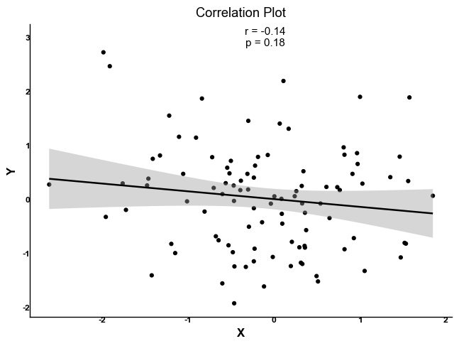

# Tidyplots for Python

<div align="center">
<table>
<tr>
<td><a href="#scatter-plot"></a></td>
<td><a href="#violin-plot"></a></td>
<td><a href="#box-plot"></a></td>
<td><a href="#density-plot"></a></td>
<td><a href="#step-plot"></a></td>
<td><a href="#dot-plot"></a></td>
</tr>
<tr>
<td><a href="#bar-plot"></a></td>
<td><a href="#line-plot"></a></td>
<td><a href="#hex-plot"></a></td>
<td><a href="#mean-bar"></a></td>
<td><a href="#sem-errorbar"></a></td>
<td><a href="#sd-errorbar"></a></td>
</tr>
<tr>
<td><a href="#beeswarm-plot"></a></td>
<td><a href="#smooth-plot"></a></td>
<td><a href="#density-2d"></a></td>
<td><a href="#regression"></a></td>
<td><a href="#ci-errorbar"></a></td>
<td><a href="#custom-errorbar"></a></td>
</tr>
<tr>
<td><a href="#correlation"></a></td>
<td><a href="#ribbon-plot"></a></td>
<td><a href="#density-2d-filled"></a></td>
<td><a href="#rug-plot"></a></td>
<td><a href="#pvalue"></a></td>
<td><a href="#count-plot"></a></td>
</tr>
<tr>
<td><a href="#jitter-plot"></a></td>
<td><a href="#hline"></a></td>
<td><a href="#vline"></a></td>
<td><a href="#text-annotation"></a></td>
<td><a href="#no-legend"></a></td>
<td><a href="#rotated-labels"></a></td>
</tr>
<tr>
<td><a href="#boxplot-jitter"></a></td>
<td><a href="#violin-quartiles"></a></td>
<td><a href="#correlation-advanced"></a></td>
<td><a href="#time-series"></a></td>
<td><a href="#density-groups"></a></td>
<td><a href="#scatter-groups"></a></td>
</tr>
</table>
</div>

A Python library for creating publication-ready plots with a fluent, chainable interface, inspired by [tidyplots R version](https://github.com/jbengler/tidyplots).

Built on top of plotnine, it provides a pandas DataFrame extension method for easy and intuitive plot creation.

todo list

* [X] complete the whole set of plotting that maps to R version
* [ ] more themes, such as ggprism
* [ ] more palettes, including palettes from famous journals, for instance, ggsci
* [ ] more plotting variations from ggpubr

## Features

- Fluent, chainable interface using pandas DataFrame extension
- Publication-ready plots with Nature Publishing Group (NPG) color palette by default
- Comprehensive set of plot types and statistical visualizations
- Statistical annotations (p-values, correlations, etc.)
- Multiple scientific journal color palettes (NPG, AAAS, NEJM, etc.)
- Easy customization of colors, labels, and themes
- Prism-style publication themes

## Installation

```bash
pip install tidyplots-python
```

for development version:

```
pip install git+https://github.com/JNU-Tangyin/tidyplots-python.git
```

## Quick Start

```python
import pandas as pd
import numpy as np
import seaborn as sns
from tidyplots import TidyPlot

# Create sample data
iris = sns.load_dataset("iris")

# Create a scatter plot with groups
(iris.tidyplot(x='x', y='y', color='group')
 .add_scatter()
 .add_smooth(method='lm')
 .adjust_labels(title='Grouped Scatter Plot')
 .show())
```


## API Reference

### Core Plot Creation

- `df.tidyplot(x, y=None, color=None)`: Initialize a plot with aesthetics

  ```python
  df.tidyplot(x='column1', y='column2', color='group')
  ```

### Plot Types

- `.add_scatter(alpha=0.6, size=3)`: Add scatter points
- `.add_line(alpha=0.8)`: Add line plot
- `.add_boxplot(alpha=0.3)`: Add box plot
- `.add_violin(draw_quantiles=[0.25, 0.5, 0.75])`: Add violin plot
- `.add_density(alpha=0.5)`: Add density plot
- `.add_density_2d()`: Add 2D density contour plot
- `.add_bar()`: Add bar plot
- `.add_errorbar(ymin, ymax)`: Add error bars
- `.add_hex(bins=20)`: Add hexbin plot
- `.add_data_points(alpha=0.3)`: Add jittered data points

### Statistical Features

- `.add_smooth(method='lm')`: Add smoothing line
- `.add_correlation_text()`: Add correlation coefficient
- `.add_pvalue(p_value, x1, x2, y)`: Add p-value annotation

### Customization

- `.adjust_labels(title=None, x=None, y=None)`: Set plot labels
- `.adjust_colors(palette)`: Change color palette
  - Available palettes: 'npg' (default), 'aaas', 'nejm', 'lancet', 'jama', 'd3', 'material', 'igv'
- `.scale_color_gradient(low, high)`: Set color gradient
- `.adjust_axis_text_angle(angle)`: Rotate axis text

### Themes

- Default theme: Prism-style with NPG colors
- Customizable base theme:

  ```python
  .adjust_theme(base_size=11, base_family="Arial")
  ```

## Plot Examples

```python
# Load all available seaborn datasets
iris = sns.load_dataset("iris")
tips = sns.load_dataset("tips")
titanic = sns.load_dataset("titanic")
planets = sns.load_dataset("planets")
diamonds = sns.load_dataset("diamonds")
flights = sns.load_dataset("flights")
```

### Basic Plots

<h3 id="scatter-plot">Scatter Plot</h3>

```python
(iris.tidyplot(x='sepal_length', y='sepal_width', color='species')
 .add_scatter(size=3, alpha=0.7)
 .adjust_labels(title='Scatter: Iris Dimensions',
               x='Sepal Length', y='Sepal Width')
 .adjust_colors('npg')
 .adjust_legend_position('right'))
```

<h3 id="violin-plot">Violin Plot</h3>

```python
(iris.tidyplot(x='species', y='petal_length')
 .add_violin(alpha=0.4, draw_quantiles=[0.25, 0.5, 0.75])
 .adjust_labels(title='Violin: Petal Length by Species',
               x='Species', y='Petal Length'))
```

<h3 id="box-plot">Box Plot</h3>

```python
(iris.tidyplot(x='species', y='petal_width')
 .add_boxplot(alpha=0.4, outlier_alpha=0.5)
 .adjust_labels(title='Box: Petal Width by Species',
               x='Species', y='Petal Width'))
```

<h3 id="density-plot">Density Plot</h3>

```python
(tips.tidyplot(x='total_bill')
 .add_density(alpha=0.4)
 .adjust_labels(title='Density: Total Bill Distribution',
               x='Total Bill', y='Density'))
```

<h3 id="step-plot">Step Plot</h3>

```python
tips_sorted = tips.sort_values('tip')
tips_sorted['cumsum'] = tips_sorted['tip'].cumsum()
(tips_sorted.tidyplot(x=range(len(tips)), y='cumsum')
 .add_step(direction='hv')
 .adjust_labels(title='Step: Cumulative Tips',
               x='Count', y='Cumulative Tips'))
```

<h3 id="dot-plot">Dot Plot</h3>

```python
(iris.tidyplot(x='petal_length', color='species')
 .add_dotplot(binwidth=0.2, stackdir='up', binaxis='x')
 .adjust_labels(title='Dot: Petal Length Distribution',
               x='Petal Length', y='Count'))
```

<h3 id="bar-plot">Bar Plot</h3>

```python
(tips.tidyplot(x='day', y='tip')
 .add_bar(stat='identity', width=0.7, alpha=0.7)
 .adjust_labels(title='Bar: Tips by Day',
               x='Day', y='Total Tips'))
```

<h3 id="line-plot">Line Plot</h3>

```python
monthly_passengers = flights.groupby('year')['passengers'].mean().reset_index()
(monthly_passengers.tidyplot(x='year', y='passengers')
 .add_line(size=1, alpha=1.0)
 .adjust_labels(title='Line: Average Passengers by Year',
               x='Year', y='Passengers'))
```

### Statistical Plots

<h3 id="hex-plot">Hex Plot</h3>

```python
(tips.tidyplot(x='total_bill', y='tip')
 .add_hex(bins=20)
 .adjust_labels(title='Hex: Tips vs Total Bill',
               x='Total Bill', y='Tip'))
```

<h3 id="mean-bar">Mean Bar</h3>

```python
(tips.tidyplot(x='day', y='tip')
 .add_mean_bar(alpha=0.4, width=0.7)
 .adjust_labels(title='Mean Bar: Average Tips by Day',
               x='Day', y='Average Tip'))
```

<h3 id="sem-errorbar">SEM Error Bar</h3>

```python
(tips.tidyplot(x='day', y='tip')
 .add_mean_bar(alpha=0.4, width=0.7)
 .add_sem_errorbar(width=0.2)
 .adjust_labels(title='SEM: Tips by Day',
               x='Day', y='Tip Amount'))
```

<h3 id="sd-errorbar">SD Error Bar</h3>

```python
(tips.tidyplot(x='day', y='tip')
 .add_mean_bar(alpha=0.4, width=0.7)
 .add_sd_errorbar(width=0.2)
 .adjust_labels(title='SD: Tips by Day',
               x='Day', y='Tip Amount'))
```

<h3 id="beeswarm-plot">Beeswarm Plot</h3>

```python
(tips.tidyplot(x='day', y='tip')
 .add_beeswarm(size=3, alpha=0.7)
 .adjust_labels(title='Beeswarm: Tips by Day',
               x='Day', y='Tip Amount'))
```

<h3 id="smooth-plot">Smooth Plot</h3>

```python
(tips.tidyplot(x='total_bill', y='tip')
 .add_scatter(size=3, alpha=0.7)
 .add_smooth(method='lm', se=True, alpha=0.2)
 .adjust_labels(title='Smooth: Tips vs Total Bill',
               x='Total Bill', y='Tip'))
```

<h3 id="density-2d">2D Density Plot</h3>

```python
(iris.tidyplot(x='sepal_length', y='sepal_width')
 .add_density_2d(alpha=0.7)
 .adjust_labels(title='2D Density: Sepal Dimensions',
               x='Sepal Length', y='Sepal Width'))
```

<h3 id="regression">Regression Plot</h3>

```python
(tips.tidyplot(x='total_bill', y='tip')
 .add_scatter(size=3, alpha=0.7)
 .add_regression_line(ci=True, alpha=0.2)
 .adjust_labels(title='Regression: Tips vs Total Bill',
               x='Total Bill', y='Tip'))
```

<h3 id="ci-errorbar">CI Error Bar</h3>

```python
(tips.tidyplot(x='day', y='tip')
 .add_mean_bar(alpha=0.4, width=0.7)
 .add_ci_errorbar(width=0.2, ci=0.95)
 .adjust_labels(title='CI: Tips by Day',
               x='Day', y='Tip Amount'))
```

<h3 id="custom-errorbar">Custom Error Bar</h3>

```python
tips_summary = tips.groupby('day').agg({
    'tip': ['mean', lambda x: x.mean() - x.std(), lambda x: x.mean() + x.std()]
}).reset_index()
tips_summary.columns = ['day', 'mean', 'lower', 'upper']
(tips_summary.tidyplot(x='day', y='mean')
 .add_mean_bar(alpha=0.4, width=0.7)
 .add_errorbar(ymin='lower', ymax='upper', width=0.2)
 .adjust_labels(title='Custom Error: Tips by Day',
               x='Day', y='Tip Amount'))
```

### Advanced Plots

<h3 id="correlation">Correlation Plot</h3>

```python
(tips.tidyplot(x='total_bill', y='tip')
 .add_scatter(size=3, alpha=0.7)
 .add_correlation_text(method='pearson', format='.3f')
 .adjust_labels(title='Correlation: Tips vs Total Bill',
               x='Total Bill', y='Tip'))
```

<h3 id="ribbon-plot">Ribbon Plot</h3>

```python
(tips.tidyplot(x='total_bill', y='tip')
 .add_ribbon(ymin='tip_min', ymax='tip_max', alpha=0.3)
 .adjust_labels(title='Ribbon: Tips Range',
               x='Total Bill', y='Tip'))
```

<h3 id="density-2d-filled">2D Density Filled</h3>

```python
(iris.tidyplot(x='sepal_length', y='sepal_width')
 .add_density_2d_filled(alpha=0.7)
 .adjust_labels(title='2D Density Filled: Sepal Dimensions',
               x='Sepal Length', y='Sepal Width'))
```

<h3 id="rug-plot">Rug Plot</h3>

```python
(tips.tidyplot(x='total_bill', y='tip')
 .add_scatter(size=3, alpha=0.7)
 .add_rug(sides='b', alpha=0.5, length=0.03)
 .adjust_labels(title='Rug: Tips vs Total Bill',
               x='Total Bill', y='Tip'))
```

<h3 id="pvalue">P-value Plot</h3>

```python
(iris.tidyplot(x='species', y='petal_length')
 .add_boxplot(alpha=0.4)
 .add_test_pvalue(test='anova', paired=False)
 .adjust_labels(title='P-value: Petal Length by Species',
               x='Species', y='Petal Length'))
```

<h3 id="count-plot">Count Plot</h3>

```python
(titanic.tidyplot(x='class')
 .add_count()
 .adjust_labels(title='Count: Passenger Class',
               x='Class', y='Count'))
```

### Customization Examples

<h3 id="jitter-plot">Jitter Plot</h3>

```python
(tips.tidyplot(x='day', y='tip')
 .add_jitter(width=0.2, size=3, alpha=0.7)
 .adjust_labels(title='Jitter: Tips by Day',
               x='Day', y='Tip Amount'))
```

<h3 id="hline">Horizontal Line</h3>

```python
(tips.tidyplot(x='day', y='tip')
 .add_scatter(size=3, alpha=0.7)
 .add_hline(yintercept=tips['tip'].mean(), color='red', alpha=0.7)
 .adjust_labels(title='HLine: Mean Tip',
               x='Day', y='Tip Amount'))
```

<h3 id="vline">Vertical Line</h3>

```python
(tips.tidyplot(x='total_bill', y='tip')
 .add_scatter(size=3, alpha=0.7)
 .add_vline(xintercept=tips['total_bill'].mean(), color='red', alpha=0.7)
 .adjust_labels(title='VLine: Mean Total Bill',
               x='Total Bill', y='Tip'))
```

<h3 id="text-annotation">Text Annotation</h3>

```python
(tips.tidyplot(x='total_bill', y='tip')
 .add_scatter(size=3, alpha=0.7)
 .add_text(x=20, y=8, label='Custom Text', color='red')
 .adjust_labels(title='Text: Tips vs Total Bill',
               x='Total Bill', y='Tip'))
```

<h3 id="no-legend">No Legend</h3>

```python
(iris.tidyplot(x='sepal_length', y='sepal_width', color='species')
 .add_scatter(size=3, alpha=0.7)
 .adjust_labels(title='No Legend Example')
 .adjust_legend_show(False))
```

<h3 id="rotated-labels">Rotated Labels</h3>

```python
diamonds_cut = diamonds.groupby('cut')['price'].mean().reset_index()
(diamonds_cut.tidyplot(x='cut', y='price')
 .add_bar(alpha=0.7)
 .adjust_labels(title='Bar Plot with Rotated Labels',
               x='Diamond Cut Category', y='Average Price')
 .adjust_axis_text_angle(45))
```

### Complex Examples

<h3 id="boxplot-jitter">Boxplot with Jitter</h3>

```python
(tips.tidyplot(x='day', y='tip')
 .add_boxplot(alpha=0.3)
 .add_jitter(width=0.2, size=3, alpha=0.5)
 .adjust_labels(title='Box Plot with Jittered Points',
               x='Day', y='Tip Amount'))
```

<h3 id="violin-quartiles">Violin with Quartiles</h3>

```python
(tips.tidyplot(x='day', y='tip')
 .add_violin(alpha=0.4, draw_quantiles=[0.25, 0.5, 0.75])
 .adjust_labels(title='Violin Plot with Quartiles',
               x='Day', y='Tip Amount'))
```

<h3 id="correlation-advanced">Advanced Correlation</h3>

```python
(tips.tidyplot(x='total_bill', y='tip')
 .add_scatter(size=3, alpha=0.7)
 .add_smooth(method='lm', se=True)
 .add_correlation_text(method='pearson')
 .adjust_labels(title='Correlation with Regression',
               x='Total Bill', y='Tip'))
```

<h3 id="time-series">Time Series</h3>

```python
(flights.tidyplot(x='year', y='passengers')
 .add_line(size=1)
 .add_smooth(method='loess', span=0.2)
 .adjust_labels(title='Passenger Trends Over Time',
               x='Year', y='Number of Passengers'))
```

<h3 id="density-groups">Density Groups</h3>

```python
(tips.tidyplot(x='total_bill', color='time')
 .add_density(alpha=0.5)
 .adjust_labels(title='Bill Distribution by Time',
               x='Total Bill', y='Density'))
```

<h3 id="scatter-groups">Scatter Groups</h3>

```python
(iris.tidyplot(x='sepal_length', y='sepal_width', color='species')
 .add_scatter(size=3, alpha=0.7)
 .add_smooth(method='lm', se=True)
 .adjust_labels(title='Sepal Dimensions by Species',
               x='Sepal Length', y='Sepal Width'))
```

## Color Palettes

Default color palettes from scientific journals:

```python
# Change color palette to Nature Publishing Group (default)
df.tidyplot(...).adjust_colors('npg')  # 
```

Available palettes (thanks to ggsci):

- 'npg': Nature Publishing Group colors (default)
- 'aaas': Science/AAAS colors
- 'nejm': New England Journal of Medicine colors
- 'lancet': The Lancet colors
- 'jama': Journal of American Medical Association colors
- 'd3': D3.js colors
- 'material': Material Design colors
- 'igv': Integrative Genomics Viewer colors

and it supports the all color schemes in matplotlib by name:

```python
cmaps = [
('Perceptually Uniform Sequential', ['viridis', 'plasma', 'inferno', 'magma']),
('Sequential', [ 'Greys', 'Purples', 'Blues', 'Greens', 'Oranges', 'Reds', 'YlOrBr', 'YlOrRd', 'OrRd', 'PuRd', 'RdPu', 'BuPu', 'GnBu', 'PuBu', 'YlGnBu', 'PuBuGn', 'BuGn', 'YlGn']),
('Sequential (2)', ['binary', 'gist_yarg', 'gist_gray', 'gray', 'bone', 'pink', 'spring', 'summer', 'autumn', 'winter', 'cool', 'Wistia','hot', 'afmhot', 'gist_heat', 'copper']),
 ('Diverging', ['PiYG', 'PRGn', 'BrBG', 'PuOr', 'RdGy', 'RdBu', 'RdYlBu', 'RdYlGn', 'Spectral', 'coolwarm', 'bwr', 'seismic']), ('Qualitative', [ 'Pastel1', 'Pastel2', 'Paired', 'Accent', 'Dark2', 'Set1', 'Set2', 'Set3', 'tab10', 'tab20', 'tab20b', 'tab20c']),
('Miscellaneous', [ 'flag', 'prism', 'ocean', 'gist_earth', 'terrain', 'gist_stern', 'gnuplot', 'gnuplot2', 'CMRmap', 'cubehelix', 'brg', 'hsv', 'gist_rainbow', 'rainbow', 'jet', 'nipy_spectral', 'gist_ncar'])
]
# Change color palette using Matplotlib colormaps
df.tidyplot(...).adjust_colors('Set1')
```

more to come ...

## Dependencies

- pandas >= 1.0.0
- numpy >= 1.18.0
- plotnine >= 0.8.0

## Notices

This project is a Python transplant from [tidyplots R version](https://github.com/jbengler/tidyplots), and it is supported by [Windsurf](https://codeium.com/windsurf).

Althought I believe the philosophy we present in this work is convenient, pythonic, and easy to use, it is however rudimentary starting point, therefore it may contain bugs and missing features. Please forgive me if you find any.

And most importantly, contributions are more than welcome! Please feel free to submit a Pull Request.

## License

This project is licensed under the MIT License - see the LICENSE file for details.

## Missing functions

Please note that not all the functions are available because of:

1. plotnine being a younger library with fewer contributors
2. Some R-specific features being harder to implement in Python
3. Different underlying graphics engines (R's grid vs Python's matplotlib)

The list is provided as below:

1. **Removed Functions** :

* `geom_hex()` - Hexagonal binning not available in plotnine
* `geom_text_repel()` - Text repulsion for avoiding overlaps not available
* `coord_polar()` - Polar coordinate system not fully supported
* `stat_density_2d_filled()` - Filled 2D density plots not available
* `geom_raster()` - High-performance raster rendering not available
* `geom_sf()` - Simple features (geographic data) not supported
* `geom_spoke()` - Spoke plots not available
* `stat_ellipse()` - Statistical ellipses not supported
* `geom_label()` - Labels with backgrounds not available
* `geom_curve()` - Curved line segments not available

2. **Modified Functions** :

* `add_data_labels_repel()` - Modified to use regular `geom_text()` instead of `geom_text_repel()`
* `add_pie_chart()` - Implemented using bar plots and coordinate transformations since native pie charts aren't supported
* `add_donut_chart()` - Similar to pie charts, implemented through workarounds
* `add_density_2d_filled()` - Had to use regular density_2d with modified aesthetics

3. **Limited Functionality** :

* `facet_grid()` - More limited options compared to ggplot2
* `scale_*_gradient2()` - Diverging color scales have limited options
* `theme()` - Some theme elements and customizations not available
* `coord_fixed()` - Fixed coordinate ratio support is limited
* `position_dodge2()` - Advanced dodging features not available

4. **Performance Differences** :

* Large dataset handling is generally slower in plotnine
* Some smoothing methods in `stat_smooth()` have fewer options
* Rendering of complex plots with many layers is less optimized
