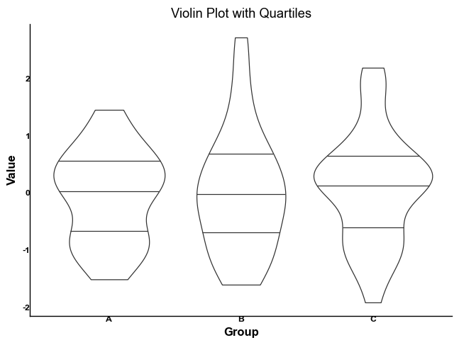

# tidyplots

A Python library for creating publication-ready plots with a fluent, chainable interface. Built on top of plotnine, it provides a pandas DataFrame extension method for easy and intuitive plot creation.

## Features

- Fluent, chainable interface using pandas DataFrame extension
- Publication-ready plots with Nature Publishing Group (NPG) color palette by default
- Comprehensive set of plot types and statistical visualizations
- Statistical annotations (p-values, correlations, etc.)
- Multiple scientific journal color palettes (NPG, AAAS, NEJM, etc.)
- Easy customization of colors, labels, and themes
- Prism-style publication themes

## Installation

```bash
pip install tidyplots
```

## Quick Start

```python
import pandas as pd
import numpy as np
from tidyplots import TidyPlot

# Create sample data
data = pd.DataFrame({
    'x': np.random.normal(0, 1, 100),
    'y': np.random.normal(0, 1, 100),
    'group': np.random.choice(['A', 'B', 'C'], 100)
})

# Create a scatter plot with groups
(data.tidyplot(x='x', y='y', color='group')
 .add_scatter()
 .add_smooth(method='lm')
 .adjust_labels(title='Grouped Scatter Plot', 
               x='X Value', 
               y='Y Value')
 .show())
```

## API Reference

### Core Plot Creation

- `df.tidyplot(x, y=None, color=None)`: Initialize a plot with aesthetics
  ```python
  df.tidyplot(x='column1', y='column2', color='group')
  ```

### Plot Types

- `.add_scatter(alpha=0.6, size=3)`: Add scatter points
- `.add_line(alpha=0.8)`: Add line plot
- `.add_boxplot(alpha=0.3)`: Add box plot
- `.add_violin(draw_quantiles=[0.25, 0.5, 0.75])`: Add violin plot
- `.add_density(alpha=0.5)`: Add density plot
- `.add_density_2d()`: Add 2D density contour plot
- `.add_bar()`: Add bar plot
- `.add_errorbar(ymin, ymax)`: Add error bars
- `.add_hex(bins=20)`: Add hexbin plot
- `.add_data_points(alpha=0.3)`: Add jittered data points

### Statistical Features

- `.add_smooth(method='lm')`: Add smoothing line
- `.add_correlation_text()`: Add correlation coefficient
- `.add_pvalue(p_value, x1, x2, y)`: Add p-value annotation

### Customization

- `.adjust_labels(title=None, x=None, y=None)`: Set plot labels
- `.adjust_colors(palette)`: Change color palette
  - Available palettes: 'npg' (default), 'aaas', 'nejm', 'lancet', 'jama', 'd3', 'material', 'igv'
- `.scale_color_gradient(low, high)`: Set color gradient
- `.adjust_axis_text_angle(angle)`: Rotate axis text

### Themes

- Default theme: Prism-style with NPG colors
- Customizable base theme:
  ```python
  .adjust_theme(base_size=11, base_family="Arial")
  ```

## Examples

### Time Series with Trend

```python
(df.tidyplot(x='time', y='value')
 .add_line()
 .add_scatter()
 .adjust_labels(title='Time Series Plot', 
               x='Date', 
               y='Value')
 .show())
```


### Scatter Plot with Groups

```python
(df.tidyplot(x='x', y='y', color='group')
 .add_scatter()
 .adjust_labels(title='Grouped Scatter Plot', 
               x='X', 
               y='Y')
 .show())
```


### Box Plot with Data Points and P-values

```python
(df.tidyplot(x='group', y='y')
 .add_boxplot()
 .add_data_points(alpha=0.3)
 .add_pvalue(0.001, 0, 2, 2.5)
 .adjust_labels(title='Box Plot with P-value', 
               x='Group', 
               y='Value')
 .show())
```


### Violin Plot with Quartiles

```python
(df.tidyplot(x='group', y='y')
 .add_violin(draw_quantiles=[0.25, 0.5, 0.75])
 .adjust_labels(title='Violin Plot with Quartiles', 
               x='Group', 
               y='Value')
 .show())
```



### Density Plot with Groups

```python
(df.tidyplot(x='y', color='group')
 .add_density(alpha=0.5)
 .adjust_labels(title='Density Plot by Group', 
               x='Value', 
               y='Density')
 .show())
```


### Bar Plot with Error Bars

```python
means = df.groupby('group')['y'].mean().reset_index()
sems = df.groupby('group')['y'].sem().reset_index()
(means.tidyplot(x='group', y='y')
 .add_bar()
 .add_errorbar(ymin=means['y']-sems['y'], 
               ymax=means['y']+sems['y'])
 .adjust_labels(title='Bar Plot with Error Bars', 
               x='Group', 
               y='Value')
 .show())
```


### Correlation Plot

```python
(df.tidyplot(x='x', y='y')
 .add_scatter()
 .add_smooth(method='lm')
 .add_correlation_text()
 .adjust_labels(title='Correlation Plot', 
               x='X', 
               y='Y')
 .show())
```


## Color Palettes

Default color palettes from scientific journals:

```python
# Change color palette
df.tidyplot(...).adjust_colors('npg')  # Nature Publishing Group (default)
df.tidyplot(...).adjust_colors('aaas')  # Science/AAAS
df.tidyplot(...).adjust_colors('nejm')  # New England Journal of Medicine
df.tidyplot(...).adjust_colors('lancet')  # The Lancet
df.tidyplot(...).adjust_colors('jama')  # Journal of American Medical Association
```

Other available palettes:
- 'd3': D3.js colors
- 'material': Material Design colors
- 'igv': Integrative Genomics Viewer colors

## Dependencies

- pandas >= 1.0.0
- numpy >= 1.18.0
- plotnine >= 0.8.0

## Contributing

Contributions are welcome! Please feel free to submit a Pull Request.

## License

This project is licensed under the MIT License - see the LICENSE file for details.
