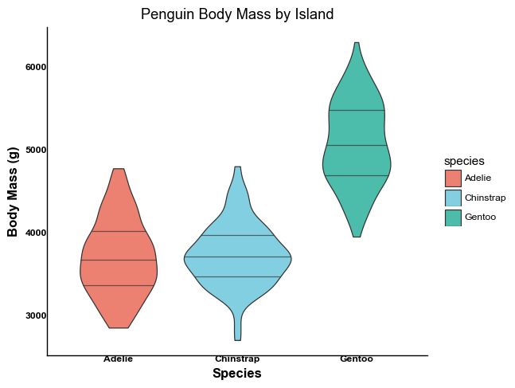
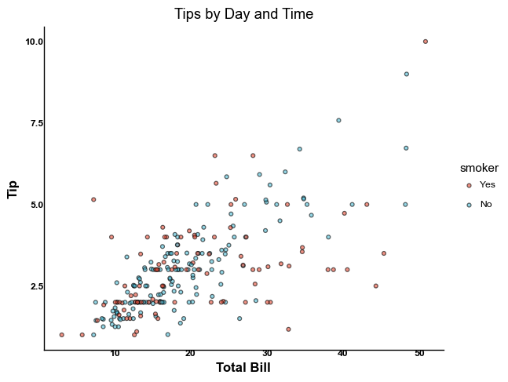
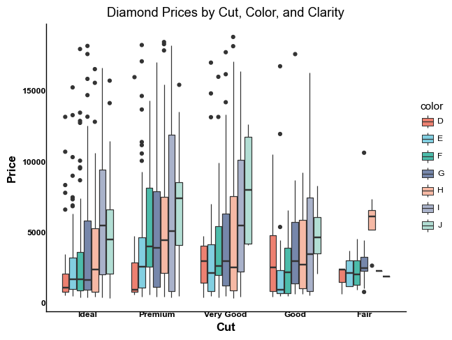

# TidyPlots Python API Reference

TidyPlots is a lightweight, publication-ready plotting library for Python, inspired by R's ggplot2. It provides a clean, intuitive interface for creating beautiful statistical visualizations.

## Installation

```bash
pip install tidyplots-python
```

## API Overview

### Core Functions

#### Plot Creation
- `tidyplot(data, mapping)`
  - `data`: DataFrame containing the variables for plotting
  - `mapping`: Aesthetic mapping (x, y, color, etc.)
  - Returns: A new tidyplot object

- `as_tidyplot(plot)`
  - `plot`: A ggplot object to convert
  - Returns: A tidyplot object

### Add Functions

#### Data Points & Amounts
- `add_data_points(size=3, alpha=0.7)`
  - `size`: Point size (default: 3)
  - `alpha`: Point transparency (default: 0.7)
  - Returns: Updated tidyplot object

- `add_data_points_jitter(width=0.2, height=0.2, size=3, alpha=0.7)`
  - `width`: Amount of horizontal jitter (default: 0.2)
  - `height`: Amount of vertical jitter (default: 0.2)
  - `size`: Point size (default: 3)
  - `alpha`: Point transparency (default: 0.7)
  - Returns: Updated tidyplot object

- `add_data_points_beeswarm(size=3, alpha=0.7)`
  - `size`: Point size (default: 3)
  - `alpha`: Point transparency (default: 0.7)
  - Returns: Updated tidyplot object

- `add_count_bar(width=0.7, alpha=0.7)`
  - `width`: Bar width (default: 0.7)
  - `alpha`: Bar transparency (default: 0.7)
  - Returns: Updated tidyplot object

- `add_count_dash(width=0.7, alpha=0.7)`
  - `width`: Dash width (default: 0.7)
  - `alpha`: Dash transparency (default: 0.7)
  - Returns: Updated tidyplot object

- `add_count_dot(size=3, alpha=0.7)`
  - `size`: Dot size (default: 3)
  - `alpha`: Dot transparency (default: 0.7)
  - Returns: Updated tidyplot object

- `add_count_value(size=11, format="%.0f")`
  - `size`: Text size (default: 11)
  - `format`: Number format string (default: "%.0f")
  - Returns: Updated tidyplot object

- `add_count_line(size=1, alpha=1)`
  - `size`: Line width (default: 1)
  - `alpha`: Line transparency (default: 1)
  - Returns: Updated tidyplot object

- `add_count_area(alpha=0.7)`
  - `alpha`: Area transparency (default: 0.7)
  - Returns: Updated tidyplot object

- `add_sum_bar(width=0.7, alpha=0.7)`
  - `width`: Width of the bars
  - `alpha`: Transparency of the bars
  - Returns: Updated tidyplot object

- `add_sum_dash(width=0.7, alpha=0.7)`
  - `width`: Width of the dashes
  - `alpha`: Transparency of the dashes
  - Returns: Updated tidyplot object

- `add_sum_dot(size=3, alpha=0.7)`
  - `size`: Size of the dots
  - `alpha`: Transparency of the dots
  - Returns: Updated tidyplot object

- `add_sum_value(size=11, format="%.1f")`
  - `size`: Size of the text
  - `format`: Format string for the values
  - Returns: Updated tidyplot object

- `add_sum_line(size=1, alpha=1)`
  - `size`: Width of the line
  - `alpha`: Transparency of the line
  - Returns: Updated tidyplot object

- `add_sum_area(alpha=0.7)`
  - `alpha`: Transparency of the area
  - Returns: Updated tidyplot object

- `add_heatmap(alpha=0.7)`
  - `alpha`: Transparency of the heatmap cells
  - Returns: Updated tidyplot object

#### Central Tendency
- `add_mean_bar(width=0.7, alpha=0.7)`
  - `width`: Bar width (default: 0.7)
  - `alpha`: Bar transparency (default: 0.7)
  - Returns: Updated tidyplot object

- `add_mean_dash(width=0.7, alpha=0.7)`
  - `width`: Dash width (default: 0.7)
  - `alpha`: Dash transparency (default: 0.7)
  - Returns: Updated tidyplot object

- `add_mean_dot(size=3, alpha=0.7)`
  - `size`: Dot size (default: 3)
  - `alpha`: Dot transparency (default: 0.7)
  - Returns: Updated tidyplot object

- `add_mean_value(size=11, format="%.1f")`
  - `size`: Text size (default: 11)
  - `format`: Number format string (default: "%.1f")
  - Returns: Updated tidyplot object

- `add_mean_line(size=1, alpha=1)`
  - `size`: Line width (default: 1)
  - `alpha`: Line transparency (default: 1)
  - Returns: Updated tidyplot object

- `add_mean_area(alpha=0.7)`
  - `alpha`: Area transparency (default: 0.7)
  - Returns: Updated tidyplot object

- `add_median_bar(width=0.7, alpha=0.7)`
  - `width`: Width of the bars
  - `alpha`: Transparency of the bars
  - Returns: Updated tidyplot object

- `add_median_dash(width=0.7, alpha=0.7)`
  - `width`: Width of the dashes
  - `alpha`: Transparency of the dashes
  - Returns: Updated tidyplot object

- `add_median_dot(size=3, alpha=0.7)`
  - `size`: Size of the dots
  - `alpha`: Transparency of the dots
  - Returns: Updated tidyplot object

- `add_median_value(size=11, format="%.1f")`
  - `size`: Size of the text
  - `format`: Format string for the values
  - Returns: Updated tidyplot object

- `add_median_line(size=1, alpha=1)`
  - `size`: Width of the line
  - `alpha`: Transparency of the line
  - Returns: Updated tidyplot object

- `add_median_area(alpha=0.7)`
  - `alpha`: Transparency of the area
  - Returns: Updated tidyplot object

- `add_curve_fit()`
  - Returns: Updated tidyplot object with fitted curve

#### Distribution & Uncertainty
- `add_histogram(bins=30, alpha=0.7)`
  - `bins`: Number of bins (default: 30)
  - `alpha`: Bar transparency (default: 0.7)
  - Returns: Updated tidyplot object

- `add_boxplot(width=0.7, alpha=0.7, outlier_size=2)`
  - `width`: Box width (default: 0.7)
  - `alpha`: Box transparency (default: 0.7)
  - `outlier_size`: Size of outlier points (default: 2)
  - Returns: Updated tidyplot object

- `add_violin(width=0.7, alpha=0.7, scale="area")`
  - `width`: Violin width (default: 0.7)
  - `alpha`: Violin transparency (default: 0.7)
  - `scale`: Scaling method ("area", "count", "width")
  - Returns: Updated tidyplot object

- `add_sem_errorbar(width=0.2)`
  - `width`: Error bar width (default: 0.2)
  - Returns: Updated tidyplot object

- `add_range_errorbar(width=0.2)`
  - `width`: Error bar width (default: 0.2)
  - Returns: Updated tidyplot object

- `add_sd_errorbar(width=0.2)`
  - `width`: Error bar width (default: 0.2)
  - Returns: Updated tidyplot object

- `add_ci95_errorbar(width=0.2)`
  - `width`: Error bar width (default: 0.2)
  - Returns: Updated tidyplot object

- `add_sem_ribbon(alpha=0.2)`
  - `alpha`: Transparency of the ribbon
  - Returns: Updated tidyplot object

- `add_range_ribbon(alpha=0.2)`
  - `alpha`: Transparency of the ribbon
  - Returns: Updated tidyplot object

- `add_sd_ribbon(alpha=0.2)`
  - `alpha`: Transparency of the ribbon
  - Returns: Updated tidyplot object

- `add_ci95_ribbon(alpha=0.2)`
  - `alpha`: Transparency of the ribbon
  - Returns: Updated tidyplot object

#### Statistical Testing
- `add_test_pvalue(format="%.3f", size=11)`
  - `format`: Number format string (default: "%.3f")
  - `size`: Text size (default: 11)
  - Returns: Updated tidyplot object

- `add_test_asterisks(size=11)`
  - `size`: Text size (default: 11)
  - Returns: Updated tidyplot object

#### Proportion
- `add_barstack_absolute(width=0.7, alpha=0.7)`
  - `width`: Width of the bars
  - `alpha`: Transparency of the bars
  - Returns: Updated tidyplot object

- `add_barstack_relative(width=0.7, alpha=0.7)`
  - `width`: Width of the bars
  - `alpha`: Transparency of the bars
  - Returns: Updated tidyplot object

- `add_areastack_absolute(alpha=0.7)`
  - `alpha`: Transparency of the areas
  - Returns: Updated tidyplot object

- `add_areastack_relative(alpha=0.7)`
  - `alpha`: Transparency of the areas
  - Returns: Updated tidyplot object

- `add_pie()`
  - Returns: Updated tidyplot object with pie chart

- `add_donut(inner_radius=0.5)`
  - `inner_radius`: Ratio of inner radius to outer radius
  - Returns: Updated tidyplot object with donut chart

#### Annotation
- `add_title(text, size=14)`
  - `text`: Title text
  - `size`: Text size (default: 14)
  - Returns: Updated tidyplot object

- `add_caption(text, size=10)`
  - `text`: Caption text
  - `size`: Text size (default: 10)
  - Returns: Updated tidyplot object

- `add_data_labels(size=11, format="%.1f")`
  - `size`: Text size (default: 11)
  - `format`: Number format string (default: "%.1f")
  - Returns: Updated tidyplot object

- `add_data_labels_repel(size=11, format="%.1f")`
  - `size`: Size of the text labels
  - `format`: Format string for the values
  - Returns: Updated tidyplot object

- `add_reference_lines()`
  - Returns: Updated tidyplot object

### Remove Functions
- `remove_legend()`
  - Returns: Updated tidyplot object
  - Description: Removes the entire legend from the plot

- `remove_legend_title()`
  - Returns: Updated tidyplot object
  - Description: Removes only the legend title while keeping the legend itself

- `remove_padding()`
  - Returns: Updated tidyplot object
  - Description: Removes padding around the plot area

- `remove_title()`
  - Returns: Updated tidyplot object
  - Description: Removes the plot title

- `remove_caption()`
  - Returns: Updated tidyplot object
  - Description: Removes the plot caption

- `remove_x_axis()`
  - Returns: Updated tidyplot object
  - Description: Removes the entire x-axis including line, ticks, labels, and title

- `remove_x_axis_line()`
  - Returns: Updated tidyplot object
  - Description: Removes only the x-axis line while keeping other elements

- `remove_x_axis_ticks()`
  - Returns: Updated tidyplot object
  - Description: Removes x-axis tick marks while keeping other elements

- `remove_x_axis_labels()`
  - Returns: Updated tidyplot object
  - Description: Removes x-axis tick labels while keeping other elements

- `remove_x_axis_title()`
  - Returns: Updated tidyplot object
  - Description: Removes x-axis title while keeping other elements

- `remove_y_axis()`
  - Returns: Updated tidyplot object
  - Description: Removes the entire y-axis including line, ticks, labels, and title

- `remove_y_axis_line()`
  - Returns: Updated tidyplot object
  - Description: Removes only the y-axis line while keeping other elements

- `remove_y_axis_ticks()`
  - Returns: Updated tidyplot object
  - Description: Removes y-axis tick marks while keeping other elements

- `remove_y_axis_labels()`
  - Returns: Updated tidyplot object
  - Description: Removes y-axis tick labels while keeping other elements

- `remove_y_axis_title()`
  - Returns: Updated tidyplot object
  - Description: Removes y-axis title while keeping other elements

### Adjust Functions

#### Components & Properties
- `adjust_colors(palette)`
  - `palette`: Color palette name or list of colors
  - Returns: Updated tidyplot object

- `adjust_font(family="Arial", size=11)`
  - `family`: Font family name (default: "Arial")
  - `size`: Base font size (default: 11)
  - Returns: Updated tidyplot object

- `adjust_legend_title(text, size=11)`
  - `text`: Legend title text
  - `size`: Text size (default: 11)
  - Returns: Updated tidyplot object

- `adjust_legend_position(position)`
  - `position`: Legend position ("right", "left", "top", "bottom", "none")
  - Returns: Updated tidyplot object

- `adjust_title(text, size=14)`
  - `text`: New title text
  - `size`: Font size of the title
  - Returns: Updated tidyplot object

- `adjust_x_axis_title(text, size=11)`
  - `text`: New x-axis title text
  - `size`: Font size of the title
  - Returns: Updated tidyplot object

- `adjust_y_axis_title(text, size=11)`
  - `text`: New y-axis title text
  - `size`: Font size of the title
  - Returns: Updated tidyplot object

- `adjust_caption(text, size=10)`
  - `text`: New caption text
  - `size`: Font size of the caption
  - Returns: Updated tidyplot object

- `adjust_size(width, height)`
  - `width`: Width of the plot in inches
  - `height`: Height of the plot in inches
  - Returns: Updated tidyplot object

- `adjust_padding(left=0.1, right=0.1, top=0.1, bottom=0.1)`
  - `left`: Left padding ratio
  - `right`: Right padding ratio
  - `top`: Top padding ratio
  - `bottom`: Bottom padding ratio
  - Returns: Updated tidyplot object

- `adjust_x_axis(limits=None, breaks=None, labels=None)`
  - `limits`: Tuple of (min, max) for axis limits
  - `breaks`: List of tick positions
  - `labels`: List of tick labels
  - Returns: Updated tidyplot object

- `adjust_y_axis(limits=None, breaks=None, labels=None)`
  - `limits`: Tuple of (min, max) for axis limits
  - `breaks`: List of tick positions
  - `labels`: List of tick labels
  - Returns: Updated tidyplot object

#### Label Management
- `rename_x_axis_labels(mapping)`
  - `mapping`: Dictionary of old labels to new labels
  - Returns: Updated tidyplot object

- `rename_y_axis_labels(mapping)`
  - `mapping`: Dictionary mapping old labels to new labels
  - Returns: Updated tidyplot object

- `rename_color_labels(mapping)`
  - `mapping`: Dictionary mapping old labels to new labels
  - Returns: Updated tidyplot object

- `reorder_x_axis_labels(order)`
  - `order`: List specifying new order of labels
  - Returns: Updated tidyplot object

- `reorder_y_axis_labels(order)`
  - `order`: List specifying new order of labels
  - Returns: Updated tidyplot object

- `reorder_color_labels(order)`
  - `order`: List specifying new order of labels
  - Returns: Updated tidyplot object

- `sort_x_axis_labels(ascending=True)`
  - `ascending`: Sort in ascending order if True
  - Returns: Updated tidyplot object

- `sort_y_axis_labels(ascending=True)`
  - `ascending`: Sort in ascending order if True
  - Returns: Updated tidyplot object

- `sort_color_labels(ascending=True)`
  - `ascending`: Sort in ascending order if True
  - Returns: Updated tidyplot object

- `reverse_x_axis_labels()`
  - Returns: Updated tidyplot object

- `reverse_y_axis_labels()`
  - Returns: Updated tidyplot object

- `reverse_color_labels()`
  - Returns: Updated tidyplot object

### Themes and Colors

#### Themes
- `theme_tidyplot()`
  - Returns: Updated tidyplot object
  - Description: Applies the default tidyplot theme with clean, publication-ready styling

- `theme_ggplot2()`
  - Returns: Updated tidyplot object
  - Description: Applies a theme that mimics the default ggplot2 styling

- `theme_minimal_xy()`
  - Returns: Updated tidyplot object
  - Description: Applies a minimal theme with both x and y axes

- `theme_minimal_x()`
  - Returns: Updated tidyplot object
  - Description: Applies a minimal theme with only x-axis

- `theme_minimal_y()`
  - Returns: Updated tidyplot object
  - Description: Applies a minimal theme with only y-axis

#### Color Schemes
- Discrete Colors:
  - `colors_discrete_friendly`: Colorblind-friendly palette
  - `colors_discrete_seaside`: Seaside-inspired color palette
  - `colors_discrete_apple`: Apple-inspired color palette
  - `colors_discrete_friendly_long`: Extended colorblind-friendly palette
  - `colors_discrete_okabeito`: Okabe-Ito color palette
  - `colors_discrete_ibm`: IBM color palette
  - `colors_discrete_metro`: Metro-inspired color palette
  - `colors_discrete_candy`: Candy-inspired color palette

- Continuous Colors:
  - `colors_continuous_viridis`: Perceptually uniform sequential colormap
  - `colors_continuous_magma`: Perceptually uniform sequential colormap
  - `colors_continuous_inferno`: Perceptually uniform sequential colormap
  - `colors_continuous_plasma`: Perceptually uniform sequential colormap
  - `colors_continuous_cividis`: Colorblind-friendly sequential colormap
  - `colors_continuous_rocket`: Sequential colormap with smooth transitions
  - `colors_continuous_mako`: Sequential colormap with smooth transitions
  - `colors_continuous_turbo`: Improved rainbow colormap
  - `colors_continuous_bluepinkyellow`: Blue-Pink-Yellow sequential colormap

- Diverging Colors:
  - `colors_diverging_blue2red`: Blue to Red diverging colormap
  - `colors_diverging_blue2brown`: Blue to Brown diverging colormap
  - `colors_diverging_BuRd`: Blue-Red diverging colormap
  - `colors_diverging_BuYlRd`: Blue-Yellow-Red diverging colormap
  - `colors_diverging_spectral`: Spectral diverging colormap
  - `colors_diverging_icefire`: Ice-Fire diverging colormap

### Output Functions
- `view_plot()`
  - Returns: None (displays plot)

- `save_plot(filename, width=7, height=7, dpi=300)`
  - `filename`: Output file path
  - `width`: Plot width in inches (default: 7)
  - `height`: Plot height in inches (default: 7)
  - `dpi`: Resolution in dots per inch (default: 300)
  - Returns: None

### Helper Functions
- `all_rows()`
- `filter_rows(condition)`
  - `condition`: Boolean condition for filtering
  - Returns: Filtered data

- `max_rows(column)`
  - `column`: Column name to find maximum values
  - Returns: Filtered data

- `min_rows(column)`
  - `column`: Column name to find minimum values
  - Returns: Filtered data

- `first_rows(n=1)`
  - `n`: Number of rows to select (default: 1)
  - Returns: First n rows

- `last_rows(n=1)`
  - `n`: Number of rows to select (default: 1)
  - Returns: Last n rows

- `sample_rows(n=1)`
  - `n`: Number of rows to sample (default: 1)
  - Returns: Random sample of rows

- `format_number(format="%.1f")`
  - `format`: Number format string (default: "%.1f")
  - Returns: Formatted number string

- `format_p_value(format="%.3f")`
  - `format`: Number format string (default: "%.3f")
  - Returns: Formatted p-value string

### Faceting

#### TidyPlot.__call__()

Create a new plot with the given aesthetics.

#### Parameters

- `x` (str): Column name for x-axis
- `y` (str, optional): Column name for y-axis
- `color` (str, optional): Column name for color aesthetic
- `fill` (str, optional): Column name for fill aesthetic
- `shape` (str, optional): Column name for shape aesthetic
- `size` (str, optional): Column name for size aesthetic
- `linetype` (str, optional): Column name for linetype aesthetic
- `split_by` (str or List[str], optional): Column name(s) for faceting
  - If str: Single column name for facet_wrap
  - If List[str]: Two column names for facet_grid (row, col)

#### Returns
- TidyPlot: Returns self for method chaining

#### Examples

##### Single Variable Faceting (facet_wrap)
```python
import pandas as pd
import seaborn as sns
from tidyplots import TidyPlot

# Scatter plot with species faceting
iris = sns.load_dataset("iris")
(iris.tidyplot(x='sepal_length', y='sepal_width', split_by='species', fill='species')
 .add_scatter(alpha=0.6)
 .adjust_labels(title='Iris Measurements by Species')
 .show())

# Violin plot with island faceting
penguins = sns.load_dataset("penguins")
(penguins.tidyplot(x='species', y='body_mass_g', split_by='island', fill='species')
 .add_violin(alpha=0.7)
 .show())
```

<div align="center">
<table>
<tr>
<td></td>
<td></td>
</tr>
</table>
</div>

##### Two-Variable Faceting (facet_grid)
```python
# Scatter plot with day and time faceting
tips = sns.load_dataset("tips")
(tips.tidyplot(x='total_bill', y='tip', split_by=['day', 'time'], fill='smoker')
 .add_scatter(alpha=0.6)
 .show())

# Boxplot with color and clarity faceting
diamonds = sns.load_dataset("diamonds")
diamonds_subset = diamonds.sample(n=1000, random_state=42)
(diamonds_subset.tidyplot(x='cut', y='price', split_by=['color', 'clarity'], fill='color')
 .add_boxplot(alpha=0.7)
 .show())
```

<div align="center">
<table>
<tr>
<td></td>
<td></td>
</tr>
</table>
</div>

##### Bar Plot with Sex Faceting
```python
# Bar plot with sex faceting
titanic = sns.load_dataset("titanic")
titanic['survived'] = titanic['survived'].map({0: 'No', 1: 'Yes'})
survival_data = titanic.groupby(['class', 'sex', 'survived']).size().reset_index(name='count')
(survival_data.tidyplot(x='class', y='count', fill='survived', split_by='sex')
 .add_bar(position='dodge', alpha=0.7)
 .show())
```

<div align="center">

</div>

### Plot Types

#### add_scatter()
Add scatter points to the plot.

#### add_line()
Add line to the plot.
{{ ... }}
